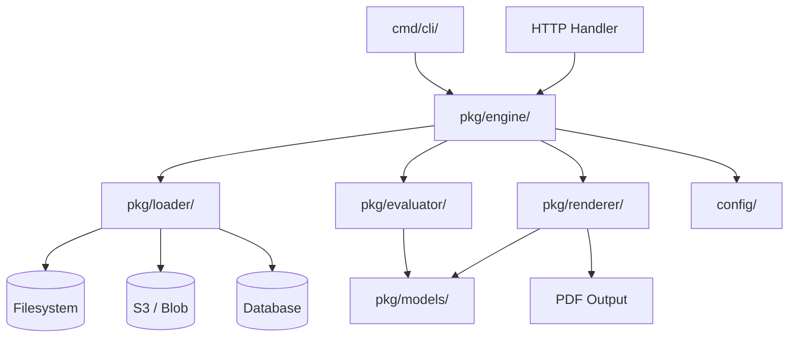

# gopdf-composer

[](https://github.com/Sergio-dot/gopdf-composer/actions/workflows/ci.yml)
[](go.mod)
[](LICENSE)

A JSON-driven, library-first PDF generation engine for Go. Define document structure, reusable assets, and control flows declaratively — inject runtime data, apply conditional logic, and generate PDFs from your API or CLI.

## Architecture



| Component | Package | Role |
|-----------|---------|------|
| Data types | `pkg/models/` | Asset, Block, ControlFlow, RuntimeContext, Condition |
| Asset loading | `pkg/loader/` | Pluggable `AssetLoader` interface (filesystem, S3, DB) |
| Conditions | `pkg/evaluator/` | Expression evaluator: `==`, `!=`, `>`, `<`, `contains`, `in`, `and`/`or`/`not` |
| PDF rendering | `pkg/renderer/` | Block-by-block rendering via gofpdf (9 files by block type) |
| Orchestration | `pkg/engine/` | Pipeline: load → evaluate → render → output |
| Configuration | `config/` | Viper: YAML, `.env`, `GOPDF_` env vars |

## Features

- **JSON-Driven**: Document structure (sections, asset refs) and content blocks (text, images, tables, lines) defined in JSON.
- **Compound Conditions**: `and`, `or`, `not` logic on asset visibility with full operator support (`==`, `!=`, `>`, `<`, `>=`, `<=`, `in`, `contains`).
- **Variable Substitution**: Inject data with `{{variable}}` syntax, including dot-notation for nested values.
- **Modular Assets**: Text, Image, Table (styled headers/rows, dynamic data sources), Container (row/column), Loop (iterate arrays), Line (horizontal rules), Page Break.
- **Page Configuration**: Custom page size (A3, A4, A5, Letter, Legal), orientation, and margins per document.
- **Configurable**: 12-factor via Viper — YAML, `.env`, and `GOPDF_` environment variables.
- **Library First**: `GenerateToBytes(cf, ctx)` for HTTP APIs, `GenerateToFile` for CLI, `GenerateToWriter` for streams.

## Quick Start

```bash
go get github.com/Sergio-dot/gopdf-composer
```

### Generate a PDF from your API

```go
eng := engine.NewEngine(cfg)
flow := &models.ControlFlow{
    Document: models.Document{Structure: []models.Section{
        {Assets: []models.AssetReference{{AssetID: "greeting", Version: "1"}}},
    }},
}
ctx := &models.RuntimeContext{Data: map[string]any{"user": "Sergio"}}

pdfBytes, _ := eng.GenerateToBytes(flow, ctx)
// write pdfBytes to http.ResponseWriter
```

### Run the showcase examples

```bash
cd examples/showcase && go run .
```

Generates PDFs for A3, A4, A5, Letter, and Legal — exercising conditions, loops, tables, lines, and page configuration.

## Configuration

| Key | Description | Default |
|-----|-------------|---------|
| `asset_dir` | Directory containing JSON assets | `assets/` |
| `control_flow_path` | Path to the document structure JSON | `flows/flow.json` |
| `runtime_context_path` | Path to the runtime data JSON | `contexts/context.json` |
| `output_path` | Output PDF path | `output/document.pdf` |
| `font_dir` | Directory containing TTF fonts | `assets/fonts` |
| `default_font` | Default font family | `Arial` |

## Contributing

See [CONTRIBUTING.md](CONTRIBUTING.md) for branch conventions, testing, and architecture details.

## License

MIT — see [LICENSE](LICENSE).
