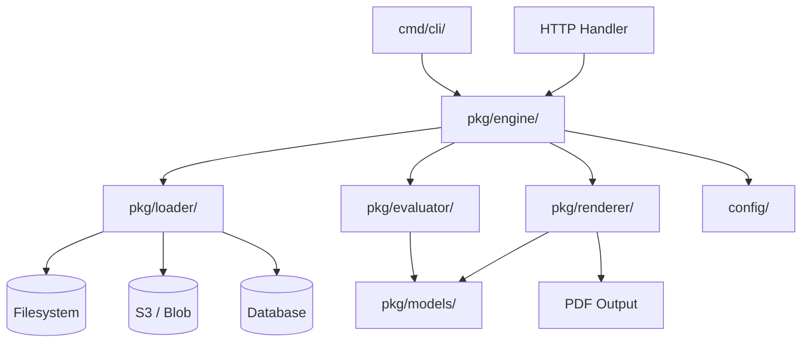

# gopdf-composer

[](https://github.com/Sergio-dot/gopdf-composer/actions/workflows/ci.yml)
[](go.mod)
[](LICENSE)

A JSON-driven, library-first PDF generation engine for Go. Define document structure, reusable assets, and control flows declaratively — inject runtime data, apply conditional logic, and generate PDFs from your API or CLI.

## Architecture



| Component | Package | Role |
|-----------|---------|------|
| Data types | `pkg/models/` | Asset, Block, ControlFlow, RuntimeContext, Condition |
| Asset loading | `pkg/loader/` | Pluggable `AssetLoader` interface (filesystem, S3, DB) |
| Conditions | `pkg/evaluator/` | Expression evaluator: `==`, `!=`, `>`, `<`, `contains`, `in`, `and`/`or`/`not` |
| PDF rendering | `pkg/renderer/` | Block-by-block rendering via gofpdf (9 files by block type) |
| Orchestration | `pkg/engine/` | Pipeline: load → evaluate → render → output |
| Configuration | `config/` | Viper: YAML, `.env`, `GOPDF_` env vars |

## Features

- **JSON-Driven**: Document structure (sections, asset refs) and content blocks (text, images, tables, lines) defined in JSON.
- **Compound Conditions**: `and`, `or`, `not` logic on asset visibility with full operator support (`==`, `!=`, `>`, `<`, `>=`, `<=`, `in`, `contains`).
- **Variable Substitution**: Inject data with `{{variable}}` syntax, including dot-notation for nested values.
- **Modular Assets**: Text, Image, Table (styled headers/rows, dynamic data sources), Container (row/column), Loop (iterate arrays), Line (horizontal rules), Page Break.
- **Page Configuration**: Custom page size (A3, A4, A5, Letter, Legal), orientation, and margins per document.
- **Configurable**: 12-factor via Viper — YAML, `.env`, and `GOPDF_` environment variables.
- **Library First**: `GenerateToBytes(cf, ctx)` for HTTP APIs, `GenerateToFile` for CLI, `GenerateToWriter` for streams.

## Quick Start

```bash
go get github.com/Sergio-dot/gopdf-composer
```

### Generate a PDF from your API

```go
eng := engine.NewEngine(cfg)
flow := &models.ControlFlow{
    Document: models.Document{Structure: []models.Section{
        {Assets: []models.AssetReference{{AssetID: "greeting", Version: "1"}}},
    }},
}
ctx := &models.RuntimeContext{Data: map[string]any{"user": "Alice"}}

pdfBytes, _ := eng.GenerateToBytes(flow, ctx)
// write pdfBytes to http.ResponseWriter
```

### Run the showcase examples

```bash
cd examples/showcase && go run .
```

Generates PDFs for A3, A4, A5, Letter, and Legal — exercising conditions, loops, tables, lines, and page configuration.

## Usage Guide

All content is defined as assets (JSON files) composed of blocks. The document structure references assets by ID and version.

### Document Structure

A `ControlFlow` ties together the document layout and the assets to render:

```go
flow := &models.ControlFlow{
    Document: models.Document{
        PageSize: "A4",
        Structure: []models.Section{
            {Assets: []models.AssetReference{
                {AssetID: "title", Version: "1"},
                {AssetID: "summary", Version: "1", Conditions: ...},
            }},
        },
    },
}
```

Assets are JSON files named `{assetID}_v{version}.json` (e.g. `assets/title_v1.json`). Each asset is a flat list of blocks:

```json
{
  "blocks": [
    { "type": "text", "textProperties": { ... } },
    { "type": "table", "tableProperties": { ... } }
  ]
}
```

### Creating Text Blocks

**Basic text with variables:**

```json
{
  "type": "text",
  "textProperties": {
    "text": "Hello {{user}}, welcome to {{company.name}}.",
    "fontSize": 12
  }
}
```

Variables use `{{var}}` syntax with dot-notation for nesting (`{{user.profile.email}}`). Built-in variables: `{{page}}` (current page number), `{{totalPages}}`.

**Styled text:**

```json
{
  "type": "text",
  "textProperties": {
    "text": "Section Title",
    "fontSize": 18,
    "fontWeight": "bold",
    "fontColor": "#333333",
    "fontFamily": "Helvetica",
    "align": "center",
    "marginTop": 10,
    "marginBottom": 5,
    "lineHeight": 8,
    "backgroundColor": "#F5F5F5"
  }
}
```

| Property | Values | Default |
|----------|--------|---------|
| `fontFamily` | Any registered or core font name | Engine default font |
| `fontWeight` | `"bold"`, `"italic"`, `"bold-italic"` | Regular |
| `fontColor` | Hex (`#RRGGBB`) | Black |
| `align` | `"left"`, `"center"`, `"right"` | `"left"` |
| `lineHeight` | Float (mm) | `fontSize * 0.5` |
| `backgroundColor` | Hex | None (transparent) |
| `marginTop` / `marginBottom` | Float (mm) | 0 |

### Text Spans (Mixed Inline Styles)

Render multiple inline fragments with independent styling in a single text block:

```json
{
  "type": "text",
  "textProperties": {
    "fontSize": 12,
    "spans": [
      { "text": "Normal text, " },
      { "text": "bold red", "fontWeight": "bold", "fontColor": "#CC0000" },
      { "text": ", " },
      { "text": "large text", "fontSize": 18, "fontFamily": "Courier" },
      { "text": "." }
    ]
  }
}
```

Each span supports `fontFamily`, `fontSize`, `fontWeight`, and `fontColor` independently. The block-level `fontFamily` and `fontSize` serve as defaults for spans that don't set their own.

### Creating Tables

**Static table:**

```json
{
  "type": "table",
  "tableProperties": {
    "headers": ["Name", "Role", "Status"],
    "rows": [
      ["Alice", "Lead", "Active"],
      ["Maria", "Developer", "Active"]
    ],
    "columnWidths": [2, 2, 1],
    "headerStyle": {
      "fontWeight": "bold",
      "fontSize": 10,
      "backgroundColor": "#CCCCCC",
      "align": "center"
    },
    "rowStyle": {
      "fontSize": 9,
      "align": "left"
    }
  }
}
```

`columnWidths` are proportional weights — `[2, 2, 1]` means the first two columns each get 40% and the last gets 20% of available width. If omitted, columns are equal width.

**Dynamic table from context data:**

```json
{
  "type": "table",
  "tableProperties": {
    "headers": ["Name", "Role"],
    "rows":[["{{item.name}}", "{{item.role}}"]],
    "rowsDataSource": "team"
  }
}
```

With context data:

```go
ctx := &models.RuntimeContext{Data: map[string]any{
    "team": []any{
        map[string]any{"name": "Alice", "role": "Lead"},
        map[string]any{"name": "Maria", "role": "Developer"},
    },
}}
```

The first row in `rows` acts as a template — `{{item.field}}` is resolved for each element in the `rowsDataSource` array. Set `itemVar` in `LoopProperties` to customize the variable name.

Cell styling (`headerStyle` / `rowStyle`) supports `fontSize`, `fontWeight`, `fontColor`, `backgroundColor`, `align`, and `cellHeight`.

### Images

```json
{
  "type": "image",
  "imageProperties": {
    "path": "assets/logo.png",
    "width": 50,
    "height": 0,
    "align": "center",
    "offsetX": 5,
    "marginTop": 10
  }
}
```

| Property | Description |
|----------|-------------|
| `path` | File path to the image |
| `width` / `height` | mm; set height to `0` for auto (maintains aspect ratio) |
| `align` | `"left"`, `"center"`, `"right"` |
| `offsetX` / `offsetY` | Fine-tune position from the aligned anchor |

### Containers (Row & Column)

**Row container** — lays children out horizontally:

```json
{
  "type": "container",
  "direction": "row",
  "gap": 5,
  "backgroundColor": "#F0F0F0",
  "border": true,
  "children": [
    { "type": "text", "widthPercent": 30, "textProperties": { "text": "Left column", "fontSize": 10 } },
    { "type": "text", "widthPercent": 70, "textProperties": { "text": "Right column", "fontSize": 10 } }
  ]
}
```

Each child can set `widthPercent` (0-100) to override equal-width distribution. Set `border: true` to draw an outline instead of a background fill.

**Column container** — lays children out vertically:

```json
{
  "type": "container",
  "direction": "column",
  "gap": 3,
  "backgroundColor": "#FAFAFA",
  "children": [
    { "type": "text", "textProperties": { "text": "Item 1", "fontSize": 10 } },
    { "type": "text", "textProperties": { "text": "Item 2", "fontSize": 10 } }
  ]
}
```

### Loops

Iterate over a context array, rendering children for each element:

```json
{
  "type": "loop",
  "loopProperties": {
    "dataSource": "items",
    "itemVar": "item"
  },
  "children": [
    { "type": "text", "textProperties": { "text": "{{item.label}} — {{item.status}}", "fontSize": 10 } }
  ]
}
```

```go
ctx := &models.RuntimeContext{Data: map[string]any{
    "items": []any{
        map[string]any{"label": "Feature A", "status": "done"},
        map[string]any{"label": "Feature B", "status": "pending"},
    },
}}
```

`itemVar` defaults to `"item"`. Children can reference `{{item.field}}` or nested paths like `{{item.profile.name}}`.

### Lines & Page Breaks

**Horizontal line:**

```json
{ "type": "line", "lineProperties": { "color": "#999999", "width": 0.5, "margin": 5 } }
```

`margin` is applied before and after the line (mm). Default width is 0.4, default color is black.

**Page break:**

```json
{ "type": "pagebreak" }
```

Forces a new page. Has no configurable properties.

### Conditions

Control asset visibility with expression trees evaluated against the runtime context:

```json
{ "assetId": "admin-section", "version": "1", "conditions": {
  "and": [
    { "field": "user.role", "op": "==", "value": "admin" },
    { "field": "account.active", "op": "==", "value": true }
  ]
}}
```

```json
{ "assetId": "warning", "version": "1", "conditions": {
  "not": { "field": "score", "op": ">=", "value": 80 }
}}
```

```json
{ "assetId": "regional", "version": "1", "conditions": {
  "or": [
    { "field": "country", "op": "in", "value": ["ES", "PT", "FR"] },
    { "field": "tier", "op": "==", "value": "premium" }
  ]
}}
```

Leaf operators: `==`, `!=`, `>`, `<`, `>=`, `<=`, `in` (array membership), `contains` (substring). `and`, `or`, and `not` can be arbitrarily nested.

### Headers & Footers

Render blocks at the top or bottom of every page:

```go
flow := &models.ControlFlow{
    Document: models.Document{
        Structure:     []models.Section{...},
        HeaderAssets:  []models.AssetReference{{AssetID: "page-header", Version: "1"}},
        FooterAssets:  []models.AssetReference{{AssetID: "page-footer", Version: "1"}},
    },
}
```

A typical footer asset with page numbers and a line separator:

```json
{
  "blocks": [
    { "type": "line", "lineProperties": { "color": "#CCCCCC", "margin": 2 } },
    { "type": "text", "textProperties": { "text": "Page {{page}} of {{totalPages}}", "fontSize": 8, "align": "right" } }
  ]
}
```

### Page Configuration

```go
flow := &models.ControlFlow{
    Document: models.Document{
        PageSize:     "Letter",
        Orientation:  "L",
        MarginLeft:   20,
        MarginRight:  15,
        MarginTop:    20,
        MarginBottom: 25,
        Structure:    []models.Section{...},
    },
}
```

| Field | Values | Default |
|-------|--------|---------|
| `PageSize` | `"A3"`, `"A4"`, `"A5"`, `"Letter"`, `"Legal"`, etc. | `"A4"` |
| `Orientation` | `"P"` (portrait), `"L"` (landscape) | `"P"` |
| `Margin*` | Float (mm) | gofpdf defaults (~10mm) |

### Fonts

**Core fonts** (no files needed): `Arial`, `Courier`, `Helvetica`, `Times`, etc. These are built into the PDF standard. The engine defaults to `Arial`.

**Custom fonts** — bundle `.ttf` files with your application and register them in config:

```yaml
# config.yaml
default_font: "Roboto"
font_dir: "assets/fonts"
font_files:
  "Roboto": "assets/fonts/Roboto-Regular.ttf"
  "OpenSans": "assets/fonts/OpenSans-Regular.ttf"
```

Or programmatically:

```go
cfg := &config.Config{
    DefaultFont: "Roboto",
    FontDir:     "assets/fonts",
    FontFiles: map[string]string{
        "Roboto": "assets/fonts/Roboto-Regular.ttf",
    },
}
```

The same `.ttf` file is used for all styles (regular, bold, italic, bold-italic). Fonts are loaded from disk at render time — they do not need to be installed on the host OS.

**Per-block font override** — set `fontFamily` on any text block:

```json
{ "type": "text", "textProperties": { "text": "Special heading", "fontFamily": "OpenSans", "fontSize": 14 } }
```

**Per-span font override** — set `fontFamily` on individual spans for mixed fonts inline:

```json
{
  "type": "text",
  "textProperties": {
    "spans": [
      { "text": "Default font, ", "fontFamily": "Roboto" },
      { "text": "monospaced", "fontFamily": "Courier" }
    ]
  }
}
```

## Configuration

| Key | Description | Default |
|-----|-------------|---------|
| `asset_dir` | Directory containing JSON assets | `assets/` |
| `control_flow_path` | Path to the document structure JSON | `flows/flow.json` |
| `runtime_context_path` | Path to the runtime data JSON | `contexts/context.json` |
| `output_path` | Output PDF path | `output/document.pdf` |
| `font_dir` | Directory containing TTF fonts | `assets/fonts` |
| `default_font` | Default font family | `Arial` |
| `font_files` | Map of font name → `.ttf` file path | — |

## Contributing

See [CONTRIBUTING.md](CONTRIBUTING.md) for branch conventions, testing, and architecture details.

## License

MIT — see [LICENSE](LICENSE).
